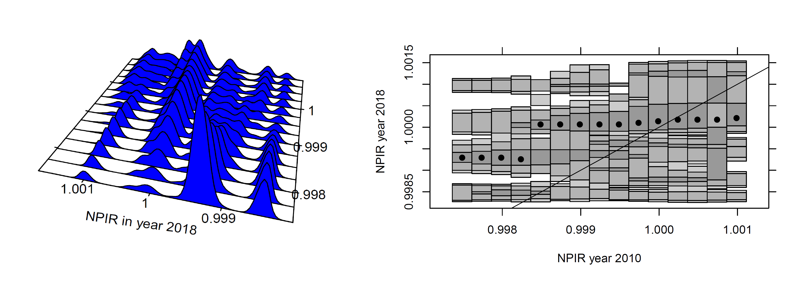
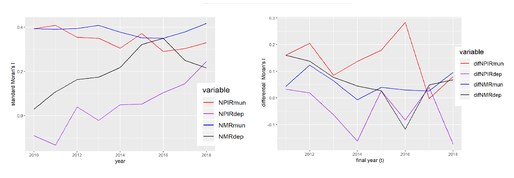

```{r setup, include=FALSE}
library(xaringan)
options(htmltools.dir.version = FALSE)
```


## Motivation:

- Beyond GDP, social variables and their convergence are relevant for development studies (Royuela et al 2015)

- Persistent income differences, differences in health indicators and in "general" regional inequality in Colombia.

- Scarce academic literature on inequality (convergence approach) at the municipality level. 
  
## Research Objective:
  
- Study convergence/divergence of homicide rates (**NMR**) and personal injury rates (**NPIR**) across municipalities and departments in Colombia 2010-2018 

- Analyze spatial autocorrelation and its robustness at different disaggregation levels

  
## Methods:

- Classical convergence framework (Barro and Sala-i-Martin 1992)

- Distributional convergence framework (Quah 1996; Hyndman et. al 1996)

- Spatial autocorrelation (Moran's I)


---

class: middle

# Main Results:

1. **Sigma Convergence** for both homicide and personal injury rates at the state level, **Beta Convergence** for both levels and rates.

2. Regional disaggretation  matters: **Local convergence clusters** 

3. **Clustering dynamics** 

  - NMR State level: 4+? convergence clusters
  - NMR Municipal level: 2+? convergence clusters
  - NPIR State level: 2 convergence clubs
  - NPIR Municipal level: stagnation and 2 convergence clubs

4. **Spatial Autocorrelation** robust only  at the municipality level
  

---

class: middle

# Outline of this presentation

1. **Data description** Non crime rates

2. **Global convergence:** Using classical summary measures

  - Beta convergence 
  - Sigma convergence 

3. **Regional disaggregation:** 

  - Distribution dynamics framework
  - Distributional convergence

4. **Global spatial autocorrelation:**

  - Disaggreagation effects
  
5. **Policy discussion**

  - The Colombian National Development Plan
 2018-22  
  - CCTs and spatial autocorrelation
  
5. **Concluding Remarks**
  
---

class: middle

# Data:

- Total number of homicides and personal injuries  in Colombia per year from 2010 until 2018 (data taken from the national police).

- Data is agreggated at the municipal  and departmental  levels.

- Population census and estimates for states and municipalitites.

- Raw rates computed $$raw\space rates = crimes / population$$

- Non crmime rates  computed　
   $$NCR= 10000- raw\ rate * 10000$$
- **Survival rates** are chosen because positively defined variables are a **standard** in the convergence literature. 

---

class: middle, center

# Data:


---
class: center, middle

# (2) **Global convergence:**
**Using  the classical convergence framework **

*Beta convergence* (the catch-up effect)


*Sigma convergence*  (the dispersion of the data decreaseses over time )
---

class: middle,center

##  States- Sigma and Beta convergence (NMR)

$$\sigma (Standard \ \space deviation)\space\sigma_{2010}= 1.84\space\space\space\space\space \sigma_{2018}=1.26$$

$$log{\frac{Y_t}{Y_0}}=\alpha +\beta *logY_0+ \epsilon \space\space\space\space\space\beta=-0.476^{***} \space\space\space\space halflife=8.59\space  years$$


---

class: middle, center

## Municipalities - ONLY Beta convergence   (NMR)

$$log{\frac{Y_t}{Y_0}}=\alpha +\beta *logY_0+ \epsilon \space\space\space\space\space\beta=-0.551^{***} \space\space\space\space halflife=6.92\space  years$$


---

class: middle, center

## Beta and sigma convergence  summary


---
class: center, middle

# (3) **State and Municipality disaggregation:The distribution dynamics framewor** 


---
class: middle, center

# (3) Local convergence clusters

**NMR State level**: 4+? convergence clusters

**NMR Municipal level**: 2+? convergence clusters

**NPIR State level **: 2 convergence clubs

**NPIR Municipal level **: stagnation and 2 convergence clubs

---
class: middle, center
##NMR at both levels

 State level: 4+? convergence clusters
 
 


Municipality level: 2+? convergence clusters


Interesting results; there are fewer clusters but sigma convergence is not present.

---
class: middle, center

##NPIR at both levels

 State level: 2 convergence clusters
 
 


Municipality level: 2 convergence clusters and stagnation


Interesting results; the same number of clusters but stagnation patterns are stronger at the municipal level

---
class: middle

# (4) Spatial Autocorrelation (Theory)

##**High Intuition Concept**      

##More Formal (less intuitive) 
$$I = \frac{\sum_i\sum_j w_{ij} z_i.z_j}{\sum_i z_i^2} = \frac{\sum_i (z_i \times \sum_j w_{ij} z_j)}{\sum_i z_i^2}.$$
##Differential Moran Scatter Plot ( $y_{i,t}−y_{i,t−1}$ )
 If there is a  fixed effect  $\mu_i$ related to location $i$, it is possible to present the value at each location for time $t$ as the sum of some intrinsic value and the fixed effect. $y_{i,t} = y*_{i,t} + \mu_i$. Differencing the variable to control for the locational fixed effects
$y_{i,t}−y_{i,t−1}$.

---

# (4) Spatial autocorrelation  (Results)

- **State level**: Moran's I statistic is significant, differntial Moran's I is not significant (**not robust**)

- **Municipal level**: Standard and Differential Moran's I significant  (**robust**)

<br /><br />



---


#(5) Policy discussion 

- vertical and horizontal policy coordination, spillovers and borders.

- It could be more appropriate for the formulation of national development plans to have convergence targets at the state level as well as the municipal level

 


---

##(5) Policy discussion - The need for a spatial perspective in current cash transfer programs:

	
-  Spatial regressions could be used to test determinant hypothesis.Moreover, such research could contribute to the literature by suggesting a case for spatially focused CCTs. 

- Ultimately, this type of analysis could serve a as tool for combating organized crime in specific locations (Ingram and Marchesini da Costa , 2017). 
 
- Ultimately, this type of analysis could serve a as tool for combating organized crime in specific locations 

 
 
 Camacho, A., & Mejía, D. (2013).
---

# (5) Concluding Remarks

## Uplifting results  "on average" :

- Differences in overall raw rates at the state level **have decreased**. On average less homicides but more personal injuries. 

- **Global convergence on average at the state level**, while fast beta convergence at the municipality level.

## Beyond classical convergence  :

- Regional differences matter in **both disaggreagation levels**.

- **Multiple local convergence clubs**; with more clubs at the state level.

## The Role of Space

- Subsequent Differential Moran's I are robust and significant at the **municipality level only**

- Results at the **state level** for NMR are not conlusive and similar to the ones reported by Royuela et al 2015.

## Policy, Space and CCTs 
---
# (5) Concluding Remarks

# Implications and further research

- Strong spatial autocorrelation suggest the posibility of applying spatial filters in order to remove the spatial component of crime variables.  

- Convergence clusters help us to find regions with similar outcomes, coordination among them can be promoted.

- Has crime followed a trajectory or are there more spill over patterns? are there local clusters? LISA analysis.

- At the state or department level (including more variables) a probit model may help us to find the determinants for a conditional "jump" to the upper clusters.


---
class: center, middle

# Thank you very much for your attention

 You can find this presentation on my website https://felipe-santos.rbind.io

If you are interested in our research please check our QuaRCS lab website <br />
https://quarcs-lab.rbind.io/

 

**Quantitative Regional and Computational Science Lab**


